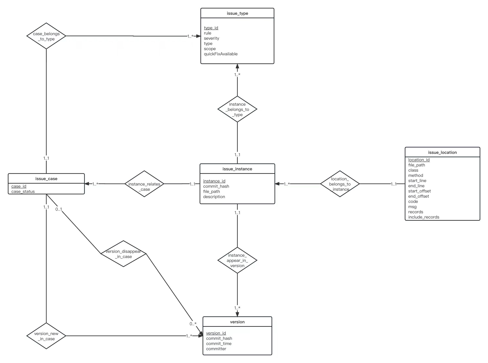

# Database Project sonarqube

## 数据库ER图



使用`Sonar Scanner`扫描后的结果，按版本存入`issue_instance`表中，关联的location存入`issue_location`表中，所属的缺陷类型记录在`issue_type`表中；接着使用映射匹配算法将缺陷匹配到现有的`issue_case`中或创建新的`issue_case`；`issue_case`代表一个缺陷的”案例“，记录着缺陷的引入和解决时间（版本）。

在`issue_location`表中有特殊的两列`records`与`include_records`记录了缺陷在所扫描版本的文件中的特征序列，用于在映射匹配算法中辅助计算，分别代表着缺陷在文件中的相对位置和调用栈。


## 数据库表结构

Issue_case:

```sql
create table issue_case (
        case_id int AUTO_INCREMENT,
        type_id int,
        version_new int,
        version_disappear int, 
        case_status varchar(255),
        primary key(case_id),
        foreign key(type_id) references issue_type(type_id)
        )
```

Issue_instance:

```sql
create table issue_instance (
        instance_id int AUTO_INCREMENT,
        type_id int,
        version_id int,
        commit_hash varchar(255),
        file_path varchar(255),
        description varchar(1023),
        case_id int,
        primary key(instance_id),
        foreign key(type_id) references issue_type(type_id),
        foreign key(version_id) references version(version_id)
        )
```

Issue_location:

```sql
create table issue_location (
        location_id int AUTO_INCREMENT,
        instance_id int,
        file_path varchar(255),
        class varchar(255),
        method varchar(255),
        start_line int,
        end_line int,
        start_offset int,
        end_offset int,
  			-- 缺陷部分的代码段
        code varchar(1023),
        msg varchar(255),
  			-- 记录缺陷在文件中的相对位置特征
        records varchar(2047),
  			-- 记录缺陷在文件中调用栈的特征
        include_records varchar(1023),
        primary key(location_id),
        foreign key(instance_id) references issue_instance(instance_id)
        )
```

issue_type:

```sql
create table issue_type (
        type_id int AUTO_INCREMENT,
        rule varchar(255),
        severity varchar(255),
        type varchar(255),
        scope varchar(255),
        quickFixAvailable varchar(255),
        primary key(type_id)
        )
```

version:

```sql
create table version (
        version_id int AUTO_INCREMENT,
        commit_hash varchar(255),
        commit_time varchar(255),
        committer varchar(255),
        primary key(version_id)
        )
```


## 数据分析需求

数据处理完毕后，执行`analyze.py`文件启动分析程序，在程序中可以输入指令来执行相应的功能。

#### 支持的功能以及对应指令：

- 分析最新版本中静态缺陷数量的分类统计以及详细列表，可以按照一下三种方式分析
   - `latest-version type`按类型统计
   - `latest-version time`按存续时长排序
   - `latest-version type_time`按类型统计存续时长的平均值和中位值
- `any-version $commit_hash`分析指定版本的代码快照中，静态缺陷引入、消除情况的分类统计以及详细列表,还会展示按类型统计、按存续时长统计、按类型统计存续时长的平均值和中位值的详细列表
- `period $start_time $end_time`分析指定一段时间内，静态缺陷引入、消除情况的分类统计以及详细列表以及详细列表,还会展示按类型统计、按存续时长统计、按类型统计存续时长的平均值和中位值的详细列表
- `committer-period $committer_time $start_time $end_time`分析指定开发人员在一段时间内，静态缺陷引入、消除情况的分类统计以及详细列表以及详细列表,还会展示按类型统计、按存续时长统计、按类型统计存续时长的平均值和中位值的详细列表。还会展示解决的缺陷的创建者
- `case $case_id`分析某一个指定的case的变化情况。会展示所有相关instance以及instance的详细信息，包括version，location，type等
- `version $version_id`展示指定版本或所有版本及其详细信息
- `instance $instance_id`展示指定instance的详细信息，包括version，location，type等


## 运行方式

源代码Github地址：https://github.com/Shan-yi-shuai/Database-Project

- 在`config.json`中配置环境信息，以下为示例

  ```json
  {
    "repo_dir": "/Users/jasonyan/Desktop/test-repo-for-database-pj/",
    "sonar_project_name": "test",
    "sonar_scanner_cmd": "/Users/jasonyan/College-Courses/Database/project/sonar-scanner-4.7.0.2747/bin/sonar-scanner -Dsonar.projectKey=%s -Dsonar.login=sqa_05cde61041a62d343835107c5bcec58bce3c499f",
    "database": {
      "host": "127.0.0.1",
      "port": 3315,
      "user": "root",
      "password": "database_design",
      "db": "sonarqube"
    },
    "sonarqube": {
      "url": "http://localhost:9000",
      "username": "admin",
      "password": "gp9nmd.XXPPXgm#"
    }
  }
  ```

- 执行`init_database.py`文件，初始化数据库并进行数据表的创建
- 执行`auto_scan.py`文件，对历史版本进行扫描并将数据入库
- 执行`analyze.py`文件，分析缺陷


## 测试数据

将开源仓库的代码重新整理后新建了一个用于测试的repo

缺陷数据约600条，映射后约有450个案例

Github地址：https://github.com/JasonYanHJ/test-repo-for-database-pj


## 性能调优

考虑到需要做多版本间的缺陷映射，若每个版本都将所有文件扫描一遍，那么版本较多时，扫描入库的时间将会花费很久。针对此，我们通过获取Git提交信息，将每个版本中改动的文件复制到新目录下（保留文件结构），在新目录下执行扫描，使得扫描入库程序能够进行增量扫描，从而大幅减少扫描时间。

```python
				// 获取改动的文件，并按改动类型记录
  			for diff in commit.diff("Head~1"):
            if diff.change_type == 'A':
                file_changes['delete'].append(diff.b_blob.path)
                continue
            elif diff.change_type == 'D':
                file_changes['add'].append(diff.a_blob.path)
                file_to_copy = diff.a_blob.path
            elif diff.change_type == 'M':
                file_changes['modify'].append(diff.b_blob.path)
                file_to_copy = diff.b_blob.path
            elif diff.change_type == 'R':
                file_changes['rename'].append((diff.a_blob.path, diff.b_blob.path))
                file_to_copy = diff.a_blob.path
            
            // 保留文件结构并复制到新目录”commit_file“中
            path = "./commit_file/" + file_to_copy
            if not os.path.exists(os.path.dirname(path)):
                os.makedirs(os.path.dirname(path))
            shutil.copy(repo_dir + file_to_copy, path)
        
        // 将改动内容写到文件，便于映射匹配程序读取
        with open('changed_files.txt', 'w') as f:
            json.dump(file_changes, f)
```


## 其他内容

在本次项目的实践过程中，主要遇到了如下两个困难

- 提前设计的ER图并不符合实践的需求：在设计ER图时，听完课后非常”振奋“地想要设计一个”尽善尽美“的ER图，然而即使在设计过程中花费了很多精力，尽可能地考虑了各种情况，但由于脱离了实际（没有详细实践Sonar Scanner的数据），导致在实践过程中，变成了”空中楼阁“，最后不得不大量删改了原有的设计。

  反思后的感想是：在数据库设计过程中，要充分考虑（并实践）我们能如何获得数据、数据间有怎样的关系，不能想当然地认为可以获得何种数据，便草率开始徒劳的设计。

- 由于使用python作为项目的实现语言，无法使用助教提供的映射匹配算法，因此花费了大量精力设计并实现了一个自己的映射匹配算法，匹配主要根据以下三项内容：

  - 缺陷的代码段
  - 缺陷在文件的相对位置
  - 缺陷在文件的调用栈

  其中代码段的比较相对容易实现，使用`difflib`库中的`SequenceMatcher`即可进行相似度比较。

  缺陷的相对位置和调用栈较为复杂，首先需要将文件转换为`AST抽象语法树`，接着根据缺陷的位置在语法树中搜索，搜索的路径可以反应出缺陷的相对位置与调用栈；将其特征序列记录后，再使用`simth_waterman`算法计算前后两个版本序列的相似度。

  将前后版本两个缺陷的上述三个特征进行对比并加权求和作为它们的”相似度“：`code_sim * 0.3 + pos_sim * 0.2 + stack_sim * 0.5`

  由于缺陷的映射应该是一对一的，所以只能不重复地挑选最合适的”缺陷对“，因此将一个文件中相似度超过0.8的”缺陷对“记录下来并从高到低排序，然后依次映射，若当前”缺陷对“中的缺陷已经被映射，则跳过该”缺陷对“。
